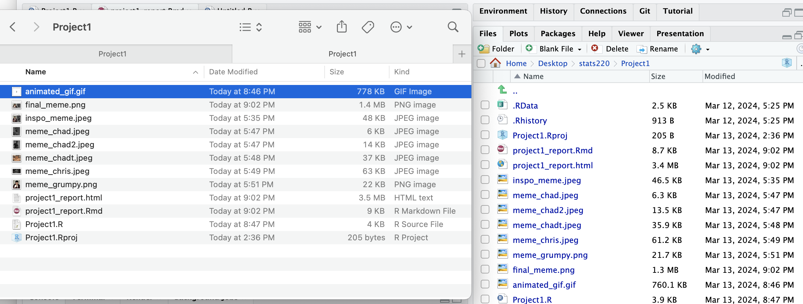
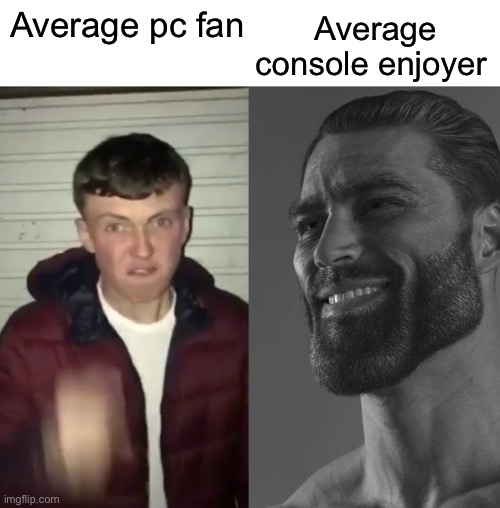
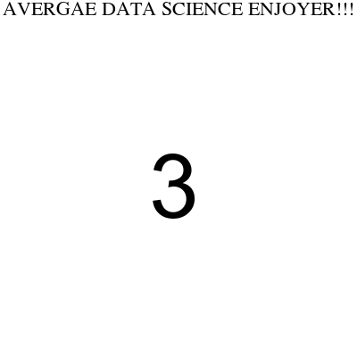

```{r setup, include=FALSE}
knitr::opts_chunk$set(echo=TRUE, message=FALSE, warning=FALSE, error=FALSE)
library(magick)
```

```{css}
/* This bit of code customizes the font and changes the background color. */
body {
  font-family: Times New Roman;
  font-size: 12pt;
  background-color: #f0f0f0;
}
/* The following code does the same thing as above but to the chunks. */
pre {
  background-color: #333333;
  color: white;
  padding: 5px;
}
```

## Project requirements
### GitHub setup
First off, I created a GitHub account with my student email. Then I created a repository called "stats220" which would be used to store my uploaded files for this course. Meanwhile, I also created a "*Readme.md*" file to present some of my information and the purpose for that file under different levels of headings and different types of bullet points, using the command for *italic* and **bold** to outline the key info. Below is the link to my Github "stats220" repo

https://github.com/JaVonthelios/stats220

Below is a screenshot of the directory I made for this course




## My meme
### Inspo meme analyse


In the inspo meme I found, the key component is to make a comparison between different types of people, in this case, apparently the creator wanted to show how grumpy a PC gamer looks on average and how masculine and a positive figure a console gamer looks like the other hand. And the inspo comprises two images and two squares of captions which is exactly what I would achieve in the chunk below.

```{r meme-code, eval=TRUE}
# first off, reading the images needed for the meme and name the image for later use
meme_chad <- image_read("meme_chad.jpeg")
meme_grumpy <- image_read("meme_grumpy.png")

# I made the two images the same sized squares
cropped_chad <- image_modulate(image_crop(meme_chad, "190x220+20"), brightness = 120, saturation = 140, hue = 90) # make Chad and Mr.grumpy the same sized figure and make the former figure clearer to see
grumpy_resize1 <- image_scale(meme_grumpy, "236")
grumpy_resize2 <- image_scale(grumpy_resize1, "x236")
chad_resize <- image_scale(cropped_chad, "x236")

# making two caption squares
cap1 <- image_blank(width = 200,
                    height = 100,
                    color = "white") %>%
        image_annotate(text = "Average probability stats lover", 
                       color = "black", 
                       size = 16, 
                       font = "Times New Roman", 
                       gravity = "center")
cap2 <- image_blank(width = 200,
                    height = 100,
                    color = "white") %>%
        image_annotate(text = "Average data science enjoyer",
                       color = "black",
                       size = 16, 
                       font = "Times New Roman", 
                       gravity = "center")

# Final stage of making the meme using image_append() and vector functions
cap_vec <- c(cap1, cap2)
top_row <- image_append(cap_vec)
img_vec <- c(grumpy_resize2, chad_resize)
bot_row <- image_append(img_vec)
# nested approach this time
final_meme <- image_scale(image_append(c(top_row, bot_row), stack = TRUE), 800)
final_meme %>% image_write("final_meme.png")
final_meme


```

### My meme creation

In the chunk above, I first read the two images into Rstudio, and resized them using image_scale() function to adjust both width and height to be the same for both images. Moreover, to make my meme just look like the inspo, I created two caption squares. Furthermore, I made the squares and images into vectors with c() function to create two rows for use. Finally, using the nested approach, I stacked the two rows using argument "stack = TRUE" under image_append() function and saved my final product in the preset directory.

```{r animation-code, eval=FALSE}
# creating the background of the meme
caption_sqr <- image_blank(width = 400,
                      height = 400,
                      color = "white") %>%
          image_annotate(text = "AVERGAE DATA SCIENCE ENJOYER!!!",
                         color = "black",
                         size = 22,
                         font = "Times New Roman",
                         gravity = "north")

background <- image_background(caption_sqr, "white", flatten = TRUE)

# add numbers to make it epic
counts <- 1 : 3 %>% as.character()

count1 <- image_blank(color = "white", width = 190, height = 220) %>%
  image_annotate(text = counts[3], size = 100, gravity = "center")

count2 <- image_blank(color = "white", width = 190, height = 220) %>%
  image_annotate(text = counts[2], size = 100, gravity = "center")

count3 <- image_blank(color = "white", width = 190, height = 220) %>%
  image_annotate(text = counts[1], size = 100, gravity = "center")

# creating the content frames of the meme
figure1 <- image_read("meme_chad.jpeg") %>%
  image_crop("190x220+20") %>%
  image_modulate(brightness = 120, saturation = 140, hue = 90)

figure2 <- image_read("meme_chad2.jpeg") %>%
  image_crop("190x220+100") %>%
  image_modulate(brightness = 120, saturation = 140, hue = 90)

figure3 <- image_read("meme_chris.jpeg") %>%
  image_scale("1000") %>%
  image_scale("x220") %>%
  image_crop("190x220+100") %>%
  image_modulate(brightness = 120, saturation = 140, hue = 90)

figure4 <- image_read("meme_chadt.jpeg") %>%
  image_scale("200") %>%
  image_scale("x220") %>%
  image_crop("190x220+30") %>%
  image_modulate(brightness = 80, saturation = 0, hue = 0)

# now we make the frames needed to be attached to the background
frame1 <- image_composite(background, count1, offset = "+100+100")
frame2 <- image_composite(background, count2, offset = "+100+100")
frame3 <- image_composite(background, count3, offset = "+100+100")
frame4 <- image_composite(background, figure1, offset = "+100+100")
frame5 <- image_composite(background, figure2, offset = "+100+100")
frame6 <- image_composite(background, figure3, offset = "+100+100")
frame7 <- image_composite(background, figure4, offset = "+100+100")

# make the frames into vector
frames <- c(frame1, frame2, frame3, frame4, frame5, frame6, frame7)
gif_meme <- image_morph(frames) %>%
            image_animate(fps = 10)
image_write(gif_meme, "animated_gif.gif")
```


The above chunk of code shows how I created my animated meme, I first created a image by annotating the caption on a blank square, and then I used background() function to make it a background. Then I created some count numbers for later use of countdown. Furthermore, I used similar code used in the static meme section to crop out water marks also adjust the size of my images, additionally, I also make the chad cat the same color tone with other images I used by adjusting the brightness, saturation and hex using image_modulate() function. Then I used image_composite() function to make my images appear on the background and make up as the frames. Finally I used image_animate() funciton to make the images, or frames into an animated gif image.

## Creativity
In general, for the CSS, I used "/**/" to make comment on what I did, furthermore, I set different colors for both background and chunk, including the font, I also adjusted the gaps between each line within the chunks.

For the static meme, I used image_crop() function to make the figures in two images pretty much the same size and to crop out the watermark. Moreover, I used image_modulate() function to adjust the brightness, saturation and hue for Chad (the figure on the right) to make his figure look clearer.I used "xnumber" argument to specify the height of the image I wanted it to be changed to.

For the animated, I used the background() function to make a background image, then I used image_composite to make the content I want to use appear on the background and to make up the frames. Additionally, I also used image_morph() function to make the fading effect.
## Learning reflection
In this project, I learnt how powerful the "magick" packge is to create or modify images. And it is quite amazing to me, also first time knowing this, that even a saved html file can show an animated image. Hence, I reckon' we can use html file to store lots of information. Furthermore, photoshop is not the only application we can think of when we want to make changes to images.

For data technologies, I still want to learn more about how to digitalize information and then visualize the data we collect. I had almost zero experience on programming with different types of languages, and when I took STATS330, I realized how powerful ggplot() function from "tidyverse" package can be. So it would be wonderful if we can learn more about stuffs from "tydiverse".

I also want to know how to make different fps under the same gif as I wanted to make the countdown slower but the image playthrough faster.


